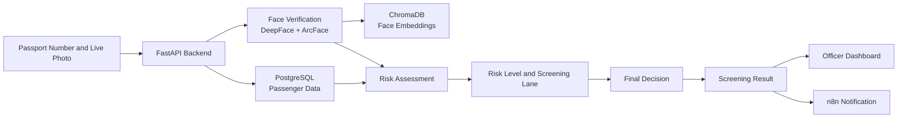
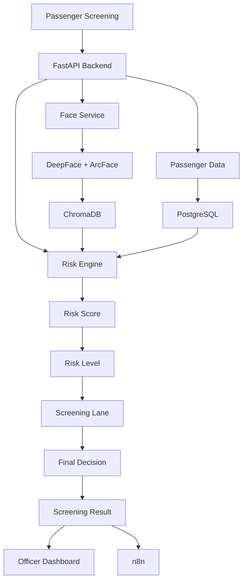
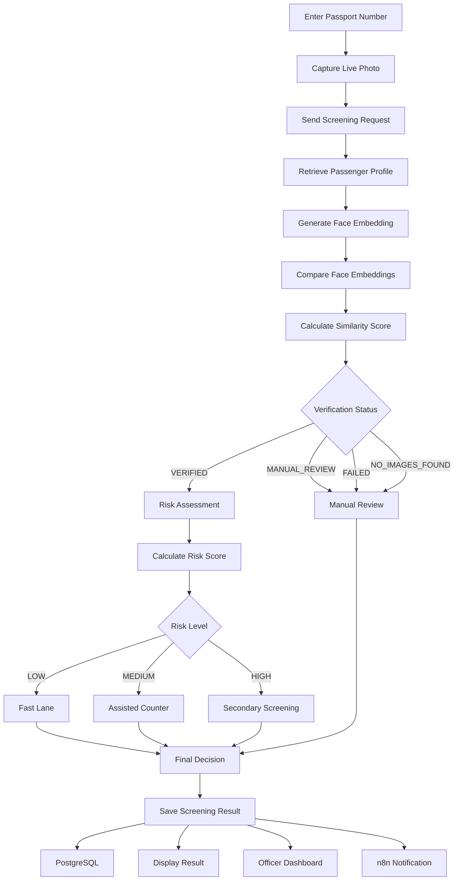
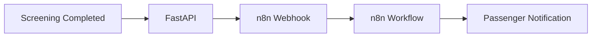

# Payanamatic

## AI-Based Smart Border & Immigration Screening System

Payanamatic is an AI-powered immigration passenger screening system designed to assist immigration officers in passenger identity verification, risk assessment, and passenger flow management.

The system combines **AI-based face verification, passenger information, visa details, enquiry forms, travel history, risk scoring, screening-lane assignment, PostgreSQL, ChromaDB, an officer dashboard, and n8n notifications** into a unified screening workflow.

---

## Table of Contents

- [Overview](#overview)
- [Problem Statement](#problem-statement)
- [Proposed Solution](#proposed-solution)
- [Objectives](#objectives)
- [System Flow Diagram](#system-flow-diagram)
- [System Architecture](#system-architecture)
- [Key Features](#key-features)
- [Face Verification](#face-verification)
- [Risk Assessment](#risk-assessment)
- [Final Decision Logic](#final-decision-logic)
- [Officer Dashboard](#officer-dashboard)
- [Technology Stack](#technology-stack)
- [Project Structure](#project-structure)
- [Database Design](#database-design)
- [ChromaDB](#chromadb)
- [API Endpoints](#api-endpoints)
- [n8n Notification Workflow](#n8n-notification-workflow)
- [Screening Workflow](#screening-workflow)
- [Installation](#installation)
- [Configuration](#configuration)
- [How to Run](#how-to-run)
- [How to Use](#how-to-use)
- [Example API Response](#example-api-response)
- [Current Project Status](#current-project-status)
- [Future Enhancements](#future-enhancements)
- [Security and Privacy](#security-and-privacy)
- [Disclaimer](#disclaimer)
- [Author](#author)

---

# Overview

Traditional immigration screening can require officers to manually verify passenger identity, passport information, visa details, travel history, and other passenger information.

Payanamatic provides an AI-assisted workflow that helps automate these repetitive screening tasks.

The system:

1. Accepts a passenger passport number.
2. Captures a live passenger image.
3. Generates a facial embedding.
4. Compares the live face with stored passenger embeddings.
5. Calculates a similarity score.
6. Retrieves passenger-related information.
7. Calculates a risk score.
8. Determines the passenger's risk level.
9. Assigns a screening lane.
10. Generates a final screening decision.
11. Stores the screening result.
12. Displays the result to the officer.
13. Updates the officer dashboard.
14. Optionally triggers an n8n notification workflow.

---

# Problem Statement

Immigration screening involves multiple verification steps such as:

- Passenger identity verification
- Passport verification
- Visa verification
- Travel-history analysis
- Enquiry-form analysis
- Risk identification
- Passenger routing

Performing these tasks manually can increase processing time and workload for immigration officers.

There is a need for an AI-assisted screening system that can combine passenger information and biometric verification to provide a faster and more organized screening workflow while keeping authorized officers involved in the final decision-making process.

---

# Proposed Solution

Payanamatic provides an AI-based passenger screening workflow using:

- **DeepFace**
- **ArcFace**
- **ChromaDB**
- **PostgreSQL**
- **FastAPI**
- **JavaScript**
- **HTML/CSS**
- **n8n**

The system uses live camera input for face verification and combines the verification result with passenger, visa, enquiry, and travel-history information.

The resulting risk level and assigned lane are displayed to the officer together with the final screening decision.

---

# Objectives

The main objectives of Payanamatic are:

- Automate passenger identity verification.
- Reduce repetitive manual screening tasks.
- Provide AI-assisted risk assessment.
- Retrieve passenger information quickly.
- Identify potential risk indicators.
- Assign passengers to appropriate screening lanes.
- Maintain screening records.
- Provide an officer monitoring dashboard.
- Provide real-time screening results.
- Support automated passenger notifications through n8n.

---

# System Flow Diagram

## System Flow Diagram

## System Architecture

## Screening Workflow

## Notification Workflow

## License

This project is developed for academic and prototype purposes.
## License
This project is developed for **SHEHACKS Finale (30th Jan 2026)**.  
Future licensing terms to be defined for production deployment.

---

## Contributors
- **Inzeera Z**  
- **Hajira Fathima M**  
- **Bismaya B**

